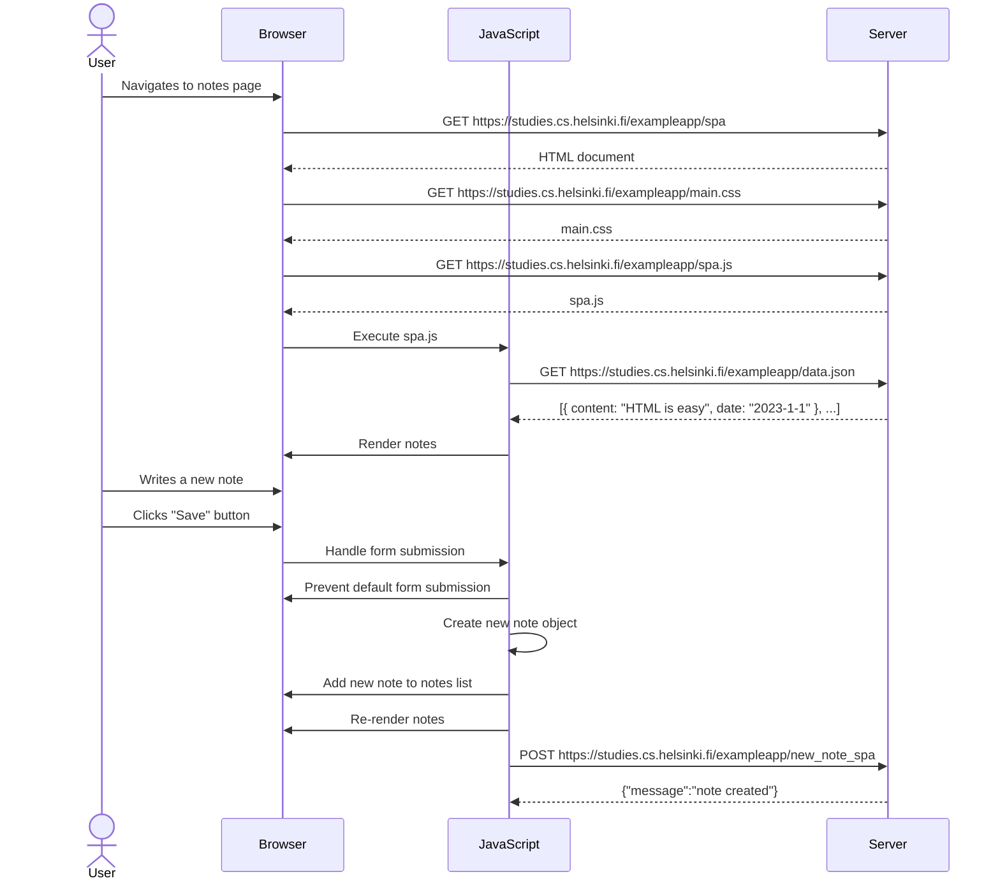

```mermaid
sequenceDiagram
    actor User
    participant Browser
    participant JavaScript
    participant Server

    User->>Browser: Navigates to notes page
    Browser->>Server: GET https://studies.cs.helsinki.fi/exampleapp/spa
    Server-->>Browser: HTML document
    Browser->>Server: GET https://studies.cs.helsinki.fi/exampleapp/main.css
    Server-->>Browser: main.css
    Browser->>Server: GET https://studies.cs.helsinki.fi/exampleapp/spa.js
    Server-->>Browser: spa.js
    Browser->>JavaScript: Execute spa.js
    JavaScript->>Server: GET https://studies.cs.helsinki.fi/exampleapp/data.json
    Server-->>JavaScript: [{ content: "HTML is easy", date: "2023-1-1" }, ...]
    JavaScript->>Browser: Render notes

    User->>Browser: Writes a new note
    User->>Browser: Clicks "Save" button
    Browser->>JavaScript: Handle form submission
    JavaScript->>Browser: Prevent default form submission
    JavaScript->>JavaScript: Create new note object
    JavaScript->>Browser: Add new note to notes list
    JavaScript->>Browser: Re-render notes
    JavaScript->>Server: POST https://studies.cs.helsinki.fi/exampleapp/new_note_spa
    Server-->>JavaScript: {"message":"note created"}
```